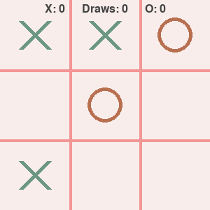

# 🎮 Tic-Tac-Toe

A classic Tic Tac Toe game built with PyGame - my first step into game development!

## 🚀 Installation

### Prerequisites
- Python 3.12 or higher
- pip (Python package installer)

### Step-by-Step Installation
1. Clone the repository:
   ```bash
   git clone https://github.com/aysieelf/tic-tac-toe.git
   cd tic-tac-toe
   ```

2. Create and activate a virtual environment (recommended):
   ```bash
   # On Windows
   python -m venv .venv
   .venv\Scripts\activate

   # On macOS/Linux
   python -m venv .venv
   source .venv/bin/activate
   ```

3. Install the required dependencies:
   ```bash
   pip install -r requirements.txt
   ```

### Running the Game
```bash
python main.py
```

### Controls
- Mouse click to place X/O
- R - Restart game
- Q - Quit game

## ⏳ Current Progress
[▓▓▓▓▓▓▓▓▓░] 90%

- [x] Project setup
- [x] Basic game mechanics
- [x] Win/Draw logic
- [x] UI implementation
- [ ] Final polish

## 🎯 Project Goals
- Create a fully functional Tic-Tac-Toe game
- Learn PyGame basics
- Practice clean code organization in game development

## 🚀 Features
- Player vs Player gameplay
- Clean minimalistic design
- Win/Draw detection
- Restart game option

## 📚 Documentation
- [User Guide](docs/user-guide.md) - Detailed instructions on how to play the game

## 📚 What I Learned
- Game loop fundamentals in PyGame (event handling, update cycles, and rendering)
- Game State management patterns for tracking game board and player turns
- Modular code organization with separate files for different game components
- Drawing game elements using PyGame's graphic primitives (lines, circles, rectangles)
- Game win/draw condition detection using sum-based algorithms
- Screen state management for handling different game screens
- Basic UI design with text rendering and button interaction

## 💡 First Time Achievements
- [x] Created my first interactive game from scratch using PyGame 
- [x] Implemented player input handling and game board mechanics
- [x] Implemented grid-based game mechanics with mouse position detection
- [x] Successfully created game state visualization system
- [x] Implemented win/draw condition detection
- [x] Created a simple UI with text rendering and button interaction

## 📸 Screenshots

### Start Screen


### Gameplay



### Game Over States


## 🎥 Demo
[Will add gif/video demo here]

## 🛠️ Technical Details
- Python version: 3.12
- PyGame version: 2.6.1

---
Part of my [Game Development Journey](https://github.com/aysieelf/Game-Dev-Journey) 🎮
